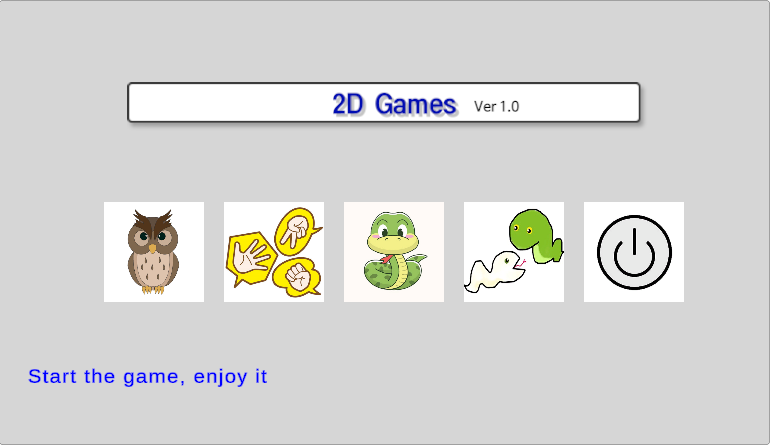
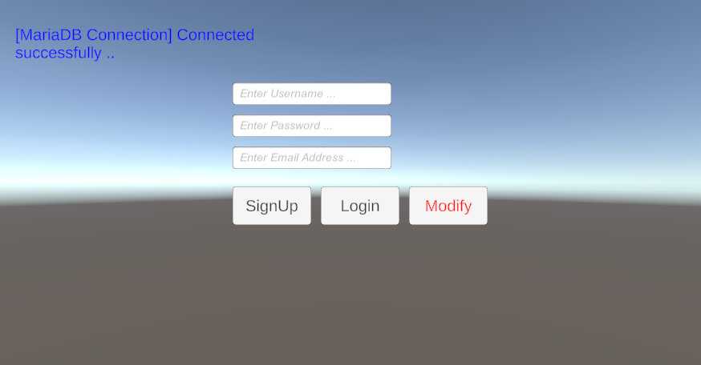
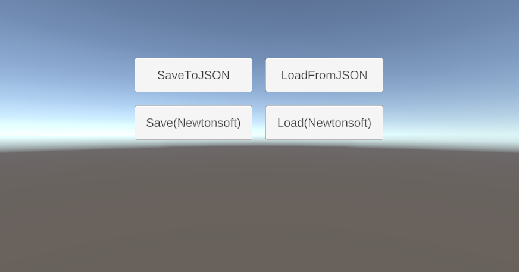
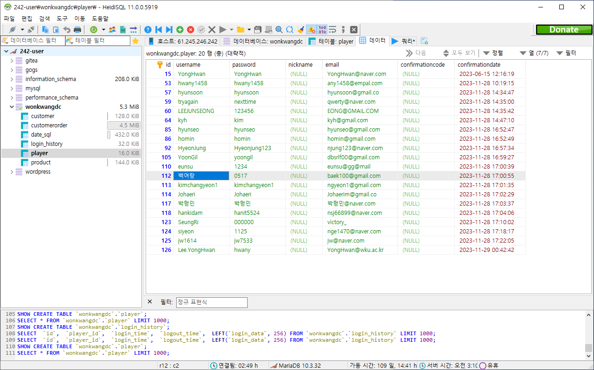

# Class Example 2D Game Project(2023)
Merged Unity Project in 2D Game Programming Class

### Figures
* 실행화면

    </img> 
    </img> 
    </img> 
    </img> 
    </img> 
    </img> 
    </img> 

### Contributor
기획 by 여랑 
디자인(아트/모델링) by  
코드 by 영훈 

